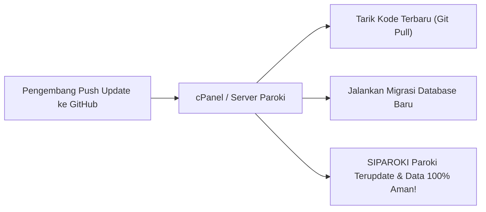

# SIPAROKI &bull; Sistem Informasi &amp; Manajemen Pastoral Paroki Terpadu

<p align="center">
  
</p>

<p align="center">
  <strong>Platform Digital Universal Gereja Katolik Tingkat Paroki se-Indonesia</strong><br>
  <em>Solusi Modern Manajemen Umat, Keluarga Katolik (KKK), 7 Sakramen Gereja, Multi-Payment Gateway Midtrans Snap, Keuangan &amp; Akuntansi, Warta Paroki, dan Pelayanan Pastoral Berbasis Web Terintegrasi.</em>
</p>

<p align="center">
  
  
  
  
  
  
  
  
</p>

---

## 🌟 Tentang SIPAROKI

**SIPAROKI (Sistem Informasi Paroki Terpadu)** adalah ekosistem aplikasi sistem informasi gerejawi komprehensif generasi terbaru berbasis **Laravel 12**, **Inertia.js v2**, dan **Vue 3 Composition API**. Aplikasi ini dirancang secara khusus untuk mendigitalkan, menertibkan, dan mengoptimalkan seluruh alur pelayanan pastoral gereja Katolik di Indonesia.

Aplikasi ini bersifat **Universal Multi-Parish Ready**, artinya dapat langsung digunakan oleh **seluruh paroki di berbagai Keuskupan di Indonesia (KWI)** dengan identitas paroki, santo pelindung, logo, struktur hierarki teritorial (Wilayah, Stasi/Kapela, KUB), dan database mandiri tanpa perlu mengubah kode sumber (*zero-code modification*).

---

## ✨ Fitur Unggulan Sistem

### 1. 🏛️ Universal Web Installation Wizard & Setup Paroki
- **Web Installer 5 Langkah**: Panduan instalasi grafis modern berbasis browser (`/installer` atau `/install.php`) untuk memeriksa kesiapan server, koneksi database, serta inisialisasi identitas paroki default.
- **Master Referensi Nasional KWI**: Terintegrasi daftar master seluruh 39 Keuskupan Agung & Sufragan se-Indonesia, Dekenat / Kevikepan, dan Paroki terdaftar.
- **Inisialisasi Paroki Otomatis**: Nama paroki, santo pelindung, alamat, kontak WhatsApp, email, nama pastor paroki, hingga logo gereja otomatis menyesuaikan di seluruh website publik dan panel administrasi.

### 2. 💳 Multi-Payment Gateway Midtrans Snap & Pembayaran Digital
- **All-in-One Channel**: Menerima pembayaran persembahan, iuran KUB, donasi pembangunan, dan intensi misa melalui:
  - **QRIS Dinamis**: Scan langsung via BCA Mobile, Livin Mandiri, BRImo, BNI Mobile, GoPay, OVO, Dana, ShopeePay, LinkAja (nominal otomatis pas).
  - **Virtual Account (VA) Bank**: BCA, Mandiri Bill, BNI, BRI, Permata, CIMB Niaga.
  - **Direct E-Wallet**: Pembayaran instan via aplikasi GoPay dan ShopeePay.
  - **Gerai Minimarket**: Bayar tunai via kasir Alfamart dan Indomaret.
  - **Kartu Kredit / Debit**: Visa, Mastercard, JCB (3D Secure).
- **Auto-Settlement Webhook Real-time**: Verifikasi tanda tangan digital SHA512 dan pembaruan otomatis status iuran/tagihan menjadi **`Lunas`** detik itu juga tanpa perlu cek mutasi manual.
- **Dukungan Metode Manual**: Tetap dapat berjalan berdampingan dengan rekening bank transfer manual & QRIS statis gambar paroki.
- **Sandbox Simulator Interaktif**: Uji coba transaksi popup Midtrans Snap langsung di panel admin tanpa uang sungguhan.

### 3. 👨‍👩‍👧‍👦 Manajemen Umat & Kartu Keluarga Katolik (KKK Digital)
- **Komponen Select2 Searchable Terstandardisasi**: Seluruh input pilihan (pekerjaan, pendidikan, golongan darah, status ekonomi, hubungan keluarga, suku, agama asal, disabilitas, status baptis, pastor pembaptis, dll.) menggunakan `SearchableSelect` dengan pencarian instan.
- **Registrasi Mandiri Umat**: Formulir pendaftaran akun umat (`/register`) dengan *live mutual filtering* antara **Wilayah**, **Stasi / Kapela**, dan **KUB (Komunitas Umat Basis)**.
- **Buku Induk Umat**: Data demografi lengkap (NIK, nama lahir, nama baptis, tempat & tanggal lahir, status perkawinan, talenta pelayanan paroki, dll.).
- **Kartu Keluarga Katolik (KKK)**: Pengelompokan kepala keluarga, hubungan keluarga, status jemaat, dan pencetakan lembar KKK resmi.

### 4. 🕊️ Administrasi & Permohonan 7 Sakramen Gereja
- **Pencatatan Sakramen Sesuai KHK (Kitab Hukum Kanonik)**:
  - **Sakramen Inisiasi**: Baptis (Bayi/Dewasa/Receptio), Krisma/Penguatan, dan Ekaristi (Komuni Pertama).
  - **Sakramen Penyembuhan**: Tobat/Rekonsiliasi dan Pengurapan Orang Sakit (Minyak Suci).
  - **Sakramen Panggilan & Persekutuan**: Perkawinan Katolik dan Tahbisan Imamat.
- **Buku Registrasi Sakramen (Liber Sacramenta)**: Pencatatan nomor jilid, halaman, dan nomor akta untuk *Liber Baptizatorum*, *Liber Confirmatorum*, dan *Liber Matrimoniorum*.
- **Permohonan Sakramen Online**: Umat dapat mengajukan sakramen mandiri, mengunggah berkas syarat, dan memantau status persetujuan sekretariat paroki.

### 5. 📲 WhatsApp Gateway & Notifikasi OTP Otomatis
- **Multi-Provider WhatsApp API**: Mendukung Fonnte, Wablas, Twilio, UltraMsg, dan Custom HTTP Webhook.
- **Verifikasi OTP**: Kode verifikasi pendaftaran dan login aman via pesan WhatsApp ke nomor jemaat.
- **Notifikasi Otomatis**: Konfirmasi penerimaan berkas sakramen, jadwal misa, dan status intensi misa.

### 6. 🛡️ Security Center, Firewall & Proteksi Sistem
- **Brute Force Protection**: Pembatasan percobaan login salah dan pemblokiran otomatis IP mencurigakan ke daftar hitam (*blocked IPs*).
- **Audit Log Keamanan**: Pencatatan riwayat login, perubahan data penting, dan aktivitas operasional seluruh admin.
- **Role-Based Access Control (RBAC)**: Pembatasan akses multi-level berbasis peran (*Least Privilege Access*) dengan enkripsi password standar Bcrypt.

### 7. 💾 Backup & Restore Database Terpadu
- **1-Klik Generate Backup**: Pencadangan otomatis struktur dan seluruh data database ke file SQL terkompresi.
- **Restore Instan**: Pemulihan database langsung dari panel admin atau melalui upload berkas backup SQL.

### 8. 📰 Portal Informasi Publik & Warta Paroki
- **Jadwal Misa Interaktif**: Jadwal perayaan ekaristi harian, mingguan, hari raya, misa lingkungan/KUB, dan misa stasi luar.
- **Video Header Hero & Banner Slider**: Penayangan video profil gereja di header beranda serta slider banner warta kegiatan.
- **Warta & Artikel Paroki**: Berita kegiatan pastoral, renungan harian, dan pengumuman sekretariat.
- **Moderasi Komentar & Filter Kata Kasar**: Filter otomatis kata-kata makian/jelek, sensor kata kasar (`***`), serta panel moderasi komentar artikel bagi redaksi.

---

## 👥 Struktur Peran & Hak Akses (9 Role Multi-Level)

| Role | Prefix URL | Cakupan Akses & Tanggung Jawab |
|---|---|---|
| **Super Admin** | `/superadmin` | Akses penuh seluruh sistem, manajemen pengguna, konfigurasi paroki default, gateway pembayaran Midtrans, backup database, dan security center. |
| **Pastor Paroki** | `/pastor` | Akses persetujuan sakramen, verifikasi data umat, laporan pastoral, jadwal misa, sambutan, dan buku kas paroki. |
| **Admin Paroki** | `/paroki` | Pengelolaan sekretariat, pendaftaran sakramen, kartu keluarga, data umat, aset, dan surat-menyurat. |
| **Admin Wilayah** | `/wilayah` | Pengelolaan data umat, KKK, dan kegiatan pada tingkat Wilayah / Lingkungan terkait. |
| **Admin Kapela / Stasi** | `/kapela` | Pengelolaan data umat, jadwal peribadatan, dan aset pada tingkat Stasi / Kapela luar. |
| **Pengurus KUB** | `/kub` | Pendataan warga basis KUB, iuran komunitas basis, dan verifikasi anggota KUB. |
| **Bendahara** | `/bendahara` | Pengelolaan transaksi keuangan, verifikasi bukti transfer/QRIS, konfirmasi Midtrans, buku kas, dan laporan keuangan. |
| **Redaksi / Komsos** | `/penulis` | Publikasi berita, artikel renungan, pengumuman, galeri media, slider banner, dan moderasi komentar publik. |
| **Umat Mandiri** | `/umat` | Akses portal umat untuk melihat data KKK digital, pengajuan sakramen, pembayaran online iuran/intensi misa, dan profil mandiri. |

---

## 📋 Persyaratan Sistem (System Requirements)

- **PHP**: Versi `8.2` atau `8.3+`
- **Database**: MySQL `5.7+` atau MariaDB `10.3+`
- **Ekstensi PHP Wajib**:
  - `pdo_mysql`, `openssl`, `mbstring`, `tokenizer`, `xml`, `ctype`, `json`, `bcmath`, `fileinfo`, `gd`, `curl`, `zip`
- **Web Server**: Apache (`mod_rewrite` aktif), Nginx, atau OpenLiteSpeed
- **Node.js & NPM**: Versi `18+` (hanya diperlukan jika ingin mengompilasi ulang aset frontend).

---

## 🚀 Panduan Instalasi (Installation Guide)

SIPAROKI 2026 telah dilengkapi dengan **Interactive Web Installer Wizard** yang langsung aktif secara otomatis saat aplikasi pertama kali dijalankan oleh paroki baru.

---

### 🌟 Metode 1: Web Installer Wizard Otomatis (Plug & Play - Sangat Mudah)

Cocok untuk pengguna **Laragon, XAMPP, Shared Hosting (cPanel), maupun Localhost**:

1. **Unduh / Klon Repositori**:
   ```bash
   git clone https://github.com/wensputra2026/siparoki2026laravel.git
   ```
   *(Atau klik tombol **Code > Download ZIP** di GitHub dan ekstrak ke folder web server Anda, contoh: `C:/laragon/www/siparoki` atau `public_html`).*

2. **Buka Aplikasi di Browser**:
   - Jika menggunakan Laragon / PHP built-in server: Buka `http://127.0.0.1:8000` atau `http://localhost/siparoki/public`
   - Jika menggunakan Domain Hosting: Buka `https://namadomainparoki.org`
   - *Sistem secara otomatis mendeteksi instalasi baru dan langsung mengarahkan Anda ke antarmuka **Web Installer Wizard (`/installer` atau `/install.php`)**.*

3. **Ikuti 5 Langkah Mudah Installer Wizard**:
   - 🔍 **Langkah 1 (Pemeriksaan Server)**: Sistem memeriksa otomatis versi PHP (`>= 8.2`), 12 ekstensi PHP penting, serta izin tulis folder. Klik **"Lanjut"**.
   - 🗄️ **Langkah 2 (Konfigurasi Database)**: Masukkan Host (`127.0.0.1` atau `localhost`), Port (`3306`), Nama Database, Username, dan Password MySQL Anda. Klik tombol **"Uji Koneksi Database"** (Database akan dibuatkan otomatis jika belum ada).
   - ⛪ **Langkah 3 (Pilih Keuskupan, Dekenat & Paroki)**: 
     - Pilih **Keuskupan** Anda dari daftar master 39 Keuskupan KWI se-Indonesia.
     - Pilih **Dekenat / Kevikepan** (otomatis memfilter paroki sesuai wilayah gerejawi).
     - Pilih **Paroki Terdaftar** (nama & alamat langsung terisi) atau pilih opsi *"+ Paroki Baru"* jika paroki Anda belum terdaftar.
     - Masukkan nama **Pastor Paroki Aktif** dan alamat sekretariat.
   - 🛡️ **Langkah 4 (Akun Super Admin Pertama)**: Masukkan Nama Lengkap, Username, Email, dan Password untuk akun Super Administrator utama Anda.
   - 🚀 **Langkah 5 (Mulai Instalasi)**: Klik **"Mulai Instalasi Sekarang"**. Sistem akan otomatis menyusun file konfigurasi `.env`, menjalankan seluruh migrasi database, menetapkan identitas paroki Anda, membuat akun Super Admin, dan mengunci file installer demi keamanan.

4. **Selesai & Siap Digunakan**:
   Klik tombol **"Masuk ke Panel SIPAROKI"** untuk langsung login ke dashboard administrator paroki Anda!

---

### 🌐 Metode 2: Panduan Lengkap Instalasi di Shared Hosting (cPanel / DirectAdmin / Plesk)

Bagi paroki yang menggunakan layanan web hosting bersama (*Shared Hosting cPanel*):

#### Langkah 1: Persiapan Versi PHP & Ekstensi di cPanel
1. Masuk ke **cPanel Hosting** Anda.
2. Cari dan buka menu **Select PHP Version** (atau *MultiPHP Manager*).
3. Atur versi PHP ke **PHP 8.2** atau **PHP 8.3**.
4. Masuk ke tab **Extensions**, pastikan ekstensi berikut dicentang aktif:
   - `pdo_mysql`, `openssl`, `mbstring`, `tokenizer`, `xml`, `ctype`, `json`, `bcmath`, `fileinfo`, `gd`, `curl`, `zip`.

#### Langkah 2: Unggah Source Code SIPAROKI
Pilih salah satu cara berikut:
- **Cara A (Menggunakan Git cPanel - Disarankan)**:
  1. Buka menu **Git™ Version Control** di cPanel.
  2. Klik **Create**.
  3. Masukkan Clone URL: `https://github.com/wensputra2026/siparoki2026laravel.git`
  4. Tentukan Repository Path: `repositories/siparoki` atau langsung di `public_html`.
  5. Klik **Create**.
- **Cara B (Upload Berkas ZIP)**:
  1. Download ZIP dari repository: [Download ZIP](https://github.com/wensputra2026/siparoki2026laravel/archive/refs/heads/main.zip).
  2. Buka **File Manager** cPanel &rarr; Masuk ke direktori `public_html` (atau folder subdomain Anda).
  3. Upload file ZIP dan ekstrak semua berkasnya.

#### Langkah 3: Penataan Folder Root Web
SIPAROKI sudah dilengkapi file `.htaccess` dan `index.php` di folder utama yang otomatis meneruskan permintaan ke folder `public/`, sehingga Anda **tidak perlu memindahkan berkas secara manual**.
- Jika Anda ingin keamanan maksimal, arahkan *Document Root* domain paroki Anda di menu cPanel **Domains / Subdomains** langsung ke folder:
  `public_html/public`

#### Langkah 4: Buat Database MySQL
1. Buka menu **MySQL&reg; Database Wizard** di cPanel.
2. Buat nama database baru (contoh: `u1234_siparoki`).
3. Buat pengguna database & password baru (contoh: `u1234_adminparoki`).
4. Berikan hak akses penuh (**ALL PRIVILEGES**), lalu klik *Make Changes*.

#### Langkah 5: Jalankan Web Installer
1. Buka browser dan akses domain paroki Anda:
   `https://namaparoki-anda.org/install.php` (atau `https://namaparoki-anda.org/installer`)
2. Masukkan nama database, username database, dan password yang baru saja dibuat di Langkah 4.
3. Pilih Keuskupan, Dekenat, dan Paroki Anda.
4. Klik **Mulai Instalasi Sekarang**. Sistem paroki Anda langsung aktif dan siap melayani umat!

---

### 🔄 Panduan Update Otomatis dari GitHub (Ketika Pengembang Merilis Fitur Baru)

Ketika tim pengembang merilis fitur baru atau perbaikan di repository [https://github.com/wensputra2026/siparoki2026laravel](https://github.com/wensputra2026/siparoki2026laravel), paroki dapat memperbarui sistem secara instan tanpa kehilangan data database maupun berkas konfigurasi paroki yang sudah berjalan.



---

#### 🌟 Pilihan 1: Update 1-Klik via cPanel Git™ Version Control (Paling Praktis untuk Shared Hosting)
1. Masuk ke **cPanel Hosting** &rarr; Buka menu **Git™ Version Control**.
2. Klik tombol **Manage** pada repository SIPAROKI Anda.
3. Klik tab **Pull or Deploy**.
4. Klik tombol biru **"Update from Remote"** (atau *Pull from Remote*).
5. cPanel akan otomatis mengunduh seluruh penambahan fitur dan pembaruan kode terbaru dari GitHub.
6. *(Opsional)* Jika ada penambahan tabel/struktur data baru dari pengembang, buka menu **Terminal cPanel** (atau Cron Job 1x) dan jalankan:
   ```bash
   php artisan migrate --force
   php artisan optimize:clear
   ```
7. Selesai! Seluruh fitur baru langsung aktif dan data umat Anda tetap 100% aman.

---

#### 🖥️ Pilihan 2: Update via SSH Terminal (Untuk VPS / Cloud Server)
```bash
# 1. Masuk ke direktori aplikasi
cd /var/www/siparoki

# 2. Tarik update terbaru dari GitHub
git pull origin main

# 3. Jalankan migrasi database jika ada skema baru
php artisan migrate --force

# 4. Bersihkan cache aplikasi agar fitur baru langsung terbaca
php artisan optimize:clear
```

---

### 🐧 Metode 3: Panduan Instalasi di VPS aaPanel (Linux / Nginx / OpenLiteSpeed / Apache)

Bagi paroki yang mengelola server VPS sendiri menggunakan **aaPanel**:

#### Langkah 1: Persiapan Environment & PHP di aaPanel App Store
1. Masuk ke **Dashboard aaPanel VPS** Anda (`http://IP-SERVER:8888`).
2. Buka menu **App Store** di bilah navigasi kiri.
3. Pastikan komponen berikut sudah terpasang:
   - **Nginx** (versi 1.22+ atau versi OpenLiteSpeed/Apache).
   - **MySQL** (versi 5.7 atau 8.0) atau **MariaDB**.
   - **PHP-8.2** atau **PHP-8.3**.
4. Klik **Setting** pada `PHP-8.2` (atau `PHP-8.3`):
   - 📦 **Tab "Install extensions"**: Install ekstensi `fileinfo`, `opcache`, `redis` (opsional), dan `exif`.
   - ⚙️ **Tab "Disabled functions"**: Hapus fungsi `putenv`, `proc_open`, `pcntl_signal`, dan `symlink` dari daftar agar Laravel & Composer dapat berjalan normal tanpa batasan.
   - 🔄 Klik **Restart** pada PHP service.

#### Langkah 2: Tambahkan Website Baru di aaPanel
1. Buka menu **Website** &rarr; Klik tombol **Add site**.
2. Masukkan nama domain paroki Anda di kolom **Domain** (contoh: `paroki-anda.org` dan `www.paroki-anda.org`).
3. Pada opsi **Database**, pilih **MySQL**:
   - aaPanel akan otomatis membuatkan nama database dan kata sandi acak. Catat kredensial ini untuk installer.
4. Pada opsi **PHP Version**, pilih **PHP-82** (atau **PHP-83**).
5. Klik **Submit**.

#### Langkah 3: Deploy Kode Sumber SIPAROKI
1. Masuk ke folder website yang baru dibuat: `/www/wwwroot/paroki-anda.org`.
2. Buka menu **Terminal** di aaPanel (atau via SSH) dan jalankan:
   ```bash
   cd /www/wwwroot/paroki-anda.org
   # Hapus file default index.html 404.html jika ada
   rm -f index.html 404.html .user.ini
   # Klon repositori SIPAROKI
   git clone https://github.com/wensputra2026/siparoki2026laravel.git .
   ```

#### Langkah 4: Pengaturan Running Directory & URL Rewrite Laravel di aaPanel
1. Di menu **Website** aaPanel &rarr; Klik nama domain website paroki Anda.
2. Buka tab **Site directory**:
   - Ubah **Running directory** dari `/` menjadi **/public**.
   - Klik **Save**.
3. Buka tab **URL rewrite**:
   - Pilih preset template **laravel5** dari dropdown (aaPanel otomatis mengisi aturan `try_files $uri $uri/ /index.php?$query_string;`).
   - Klik **Save**.

#### Langkah 5: Atur Hak Akses Folder (Permissions)
Buka menu **Terminal** aaPanel dan jalankan perintah izin folder Laravel:
```bash
cd /www/wwwroot/paroki-anda.org
chown -R www:www storage bootstrap/cache public/uploads
chmod -R 775 storage bootstrap/cache public/uploads
```

#### Langkah 6: Pasang SSL Gratis (HTTPS)
1. Di jendela pengaturan website aaPanel &rarr; Buka tab **SSL**.
2. Pilih tab **Let's Encrypt** &rarr; Centang domain paroki Anda.
3. Klik **Apply**. Setelah berhasil terbit, aktifkan toggle **Force HTTPS**.

#### Langkah 7: Jalankan Web Installer Wizard
1. Buka browser Anda: `https://paroki-anda.org/installer` (atau `https://paroki-anda.org/install.php`).
2. Masukkan kredensial database yang didapatkan pada Langkah 2.
3. Pilih Keuskupan, Dekenat, dan Paroki Anda dari master data 39 Keuskupan KWI.
4. Masukkan akun Super Administrator paroki Anda.
5. Klik **Mulai Instalasi Sekarang**. Website paroki siap online dan dapat diakses publik!

---

### 💻 Metode 4: Instalasi Manual via Terminal / VPS Linux (Untuk Pengembang)

Untuk instalasi di server VPS murni tanpa control panel (Ubuntu / Debian / CentOS / Nginx / Apache):

1. **Klon Repositori**:
   ```bash
   cd /var/www
   git clone https://github.com/wensputra2026/siparoki2026laravel.git siparoki
   cd siparoki
   ```

2. **Install Dependensi Composer**:
   ```bash
   composer install --no-dev --optimize-autoloader
   ```

3. **Konfigurasi Environment File**:
   ```bash
   cp .env.example .env
   php artisan key:generate
   ```
   *Buka berkas `.env` dan sesuaikan kredensial database (`DB_DATABASE`, `DB_USERNAME`, `DB_PASSWORD`), serta `APP_URL`.*

4. **Impor Skema Database Awal**:
   ```bash
   # Impor database baseline yang telah dilengkapi master Keuskupan & Paroki se-Indonesia
   mysql -u username_db -p nama_database < public/installer/database/siparoki.sql
   ```

5. **Atur Izin Folder (Permissions)**:
   ```bash
   chmod -R 775 storage bootstrap/cache public/uploads
   chown -R www-data:www-data storage bootstrap/cache public/uploads
   ```

6. **Konfigurasi Nginx Server Block (Contoh)**:
   ```nginx
   server {
       listen 80;
       server_name paroki-anda.org www.paroki-anda.org;
       root /var/www/siparoki/public;

       index index.php index.html;

       location / {
           try_files $uri $uri/ /index.php?$query_string;
       }

       location ~ \.php$ {
           include snippets/fastcgi-php.conf;
           fastcgi_pass unix:/var/run/php/php8.2-fpm.sock;
           fastcgi_param SCRIPT_FILENAME $realpath_root$fastcgi_script_name;
           include fastcgi_params;
       }

       location ~ /\.(?!well-known).* {
           deny all;
       }
   }
   ```

7. **Buka Aplikasi**:
   Akses `http://paroki-anda.org/installer` untuk menyelesaikan penyesuaian paroki Anda.

---

## 🛠️ Pengembangan Frontend (Build Assets)

Aplikasi ini menggunakan perpaduan **Inertia.js**, **Vue 3 (Composition API)**, dan **Tailwind CSS**. Jika Anda melakukan modifikasi pada file komponen di `resources/js/`:

```bash
# Install package Node.js
npm install

# Jalankan dev server lokal
npm run dev

# Kompilasi asset untuk server produksi
npm run build
```

---

## 📁 Struktur Direktori Utama Proyek

```plaintext
siparoki/
├── app/
│   ├── Http/
│   │   ├── Controllers/       # Controller (Auth, Panel, SetupParoki, MidtransController, dll.)
│   │   │   └── Concerns/      # Modul modular (KkModuleTrait, GenericModuleTrait, SettingsModuleTrait)
│   │   └── Middleware/        # Middleware (PanelAccess, EnsureParokiConfigured, CheckInstalled, dll.)
│   ├── Models/                # Eloquent Models (Umat, KK, Sakramen, Midtrans, Paroki, Keuskupan, dll.)
│   └── Services/              # Service Layer (MidtransService, dll.)
├── bootstrap/                 # Konfigurasi bootstrap Laravel 12 & CSRF Exception
├── database/
│   ├── data/                  # Master JSON Keuskupan & baseline SQL
│   ├── migrations/            # Berkas migrasi database
│   └── seeders/               # Database seeders
├── public/
│   ├── assets/                # Aset statis frontend & backend
│   ├── build/                 # Hasil kompilasi Vite production bundle
│   ├── installer/             # Database baseline & master JSON installer
│   ├── uploads/               # Direktori berkas unggahan publik (logo, gambar, dokumen)
│   ├── install.php            # Standalone Web Installer
│   └── index.php              # Front controller publik
├── resources/
│   ├── js/
│   │   ├── Components/        # Komponen UI Vue (SearchableSelect, RichTextEditor, dll.)
│   │   ├── Composables/       # Composable Vue 3 (useMidtransSnap, useRoleMenu)
│   │   ├── Layouts/           # Layout utama (AppLayout, Dashboard layout)
│   │   └── Pages/             # Halaman Inertia Vue (Auth, ProfilParoki, PengaturanHub, UmatForm, KkForm, dll.)
│   └── views/                 # Blade templates (Halaman publik, register, login)
├── routes/
│   └── web.php                # Seluruh rute aplikasi, panel navigasi & webhook Midtrans
└── install.php                # Root installer forwarder (untuk Shared Hosting)
```

---

## 🤝 Kontribusi & Dukungan

Aplikasi ini dikembangkan dan didedikasikan untuk kemajuan digitalisasi pastoral gereja Katolik di Indonesia. Kontribusi berupa saran, pelaporan bug (*issue*), maupun *pull request* sangat dipersilakan.

- **Repositori GitHub**: [https://github.com/wensputra2026/siparoki2026laravel](https://github.com/wensputra2026/siparoki2026laravel)
- **Author / Maintainer**: Tim Pengembang SIPAROKI

---

## 📄 Lisensi (License)

SIPAROKI dirilis di bawah lisensi terbuka [MIT License](LICENSE). Anda bebas menggunakan, memodifikasi, dan mendistribusikan aplikasi ini untuk kebutuhan paroki dan keuskupan Anda.

---
<p align="center">
  <em>"Melayani dengan Kasih dan Menata Pelayanan Pastoral Secara Terpadu."</em><br>
  <strong>SIPAROKI &copy; 2026</strong>
</p>
